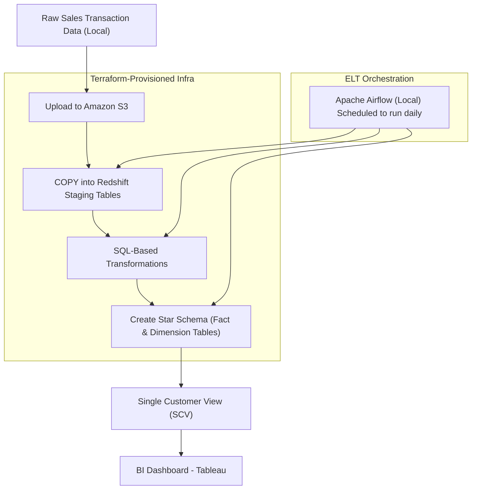
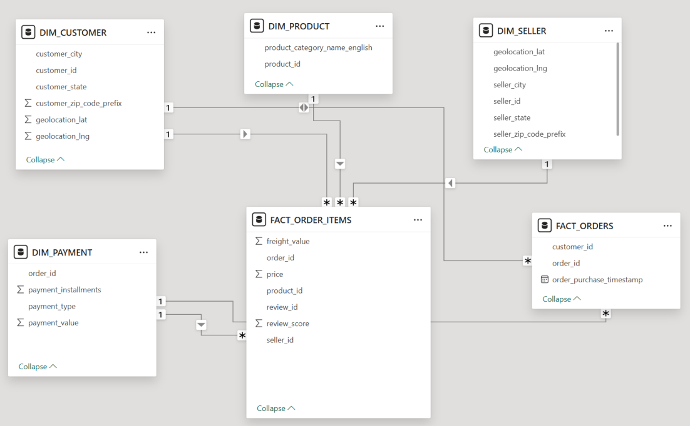
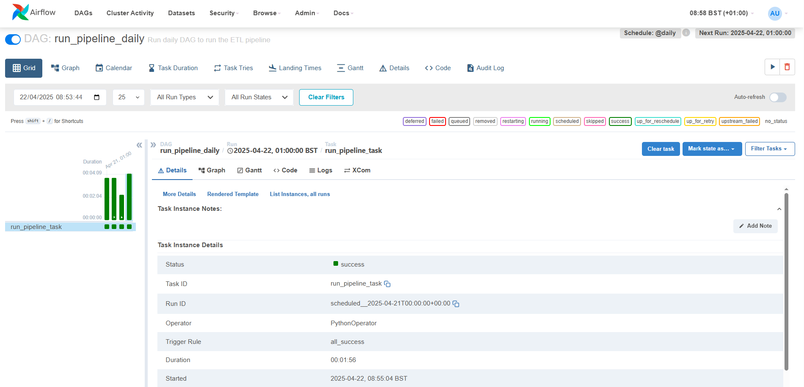

# End-to-End Data Engineering Project (Python, SQL, Airflow, Redshift & Terraform)

## 1. Project Overview
This project builds an **ELT pipeline** that loads raw sales transaction data from **AWS S3** into an **Amazon Redshift** data warehouse, where it is then transformed for **business intelligence (BI) and reporting**. The pipeline follows a **star schema model** and is orchestrated using **Apache Airflow (local setup)**.

The project uses S3 as a data lake to store structured historical data from an OLTP system. Because OLTP data is highly normalized and lacks business logic, it is not immediately useful for analysis. To address this, raw data is first **loaded into Redshift staging tables**, and then transformed into analytical **fact and dimension tables** using **SQL-based transformations** aligned with dimensional modeling standards. The final objective is to produce a **Single Customer View (SCV)** that enhances decision-making and insight generation across the business.

## 2. Problem Statement
E-commerce businesses often store transactional data in **AWS S3**, but it remains **semi-structured and inefficient** for analysis. This project automates the daily batch **loading** of new data into **Amazon Redshift**, where it is then **transformed** into a clean, denormalized schema for sales, customer, and product analytics.

## 3. Flow Diagram
> **Note**: This diagram is best viewed on desktop for proper rendering

## 4. Tech Stack

- **Infrastructure as Code**: Terraform
- **Cloud Services**: AWS S3 (Data Lake), Amazon Redshift (Data Warehouse), IAM
- **Scripting & Automation**: Python (EDA with Pandas, for executing SQL scripts and Redshift connection via psycopg2)
- **Transformation Framework**: SQL (Redshift)
- **Orchestration**: Apache Airflow (Local Setup)

---

## 5. Project Milestones

### ✅ Completed Work

- **Provisioned Infrastructure with Terraform**
  - Set up and configured AWS services using Terraform modules:
    - **Amazon S3** bucket for storing raw data in Parquet format
    - **Amazon Redshift Serverless** cluster for data warehousing
    - **IAM roles and policies** to securely allow Redshift to access data in S3
  - Infrastructure is fully reproducible via code and can be torn down/recreated reliably

- **Exploratory Data Analysis (EDA)**
  - Performed EDA using python pandas on raw CSVs (from the Olist dataset) to understand:
    - Schema structure and relationships between entities
    - Data types, null values, inconsistencies, and distributions
    - Business-relevant metrics (e.g. sales volume, delivery performance, review scores)
  - Used insights from EDA to inform star schema design and transformation logic

- **Data Ingestion into Redshift**
  - Uploaded raw CSVs into the S3 bucket in preparation for batch processing
  - Created Redshift **staging tables** for each dataset to mirror the raw structure
  - Loaded data from S3 into Redshift staging using `COPY` commands

- **SQL Transformations & Business Logic**
  - Designed a **star schema** with appropriate fact and dimension tables
  - Wrote SQL scripts to:
    - Join, clean, and reshape staging data
    - Apply core business rules (e.g. aggregations, derived metrics, handling duplicates)
    - Populate fact tables (e.g. orders, order items) and dimension tables (e.g. customers, products)
    - Below is the ERD diagram of the fact and dimension tables produced:

   
- **Developed Airflow DAG file**
    - Created production-ready DAGs to automate the ELT pipeline
    - DAG scheduled to run daily via Airflow local webserver
    - Below is a successful DAG run in the Airflow UI:

- **Built BI Dashboard in Tableau Public**
  - Exported analytical tables as CSV from Redshift using Python
  - Built two dashboards:
    - **Top Customers & Geographic Insights**: customer spending patterns, review scores, and distribution across Brazil
    - **Regional Sales & Performance Trends**: revenue trends, high-performing states/cities, and average order value
  - Included annotations and explanatory text to highlight key insights
  - BI dashboard screenshots are displayed in the section below

## 7. BI Dashboards
> **Note**: Download the file `Olist_Dashboard.twb` and open this in Tableau Public Desktop to view interactively

### Regional Sales & Performance Trends

---

### Top Customers & Geographic Insights

